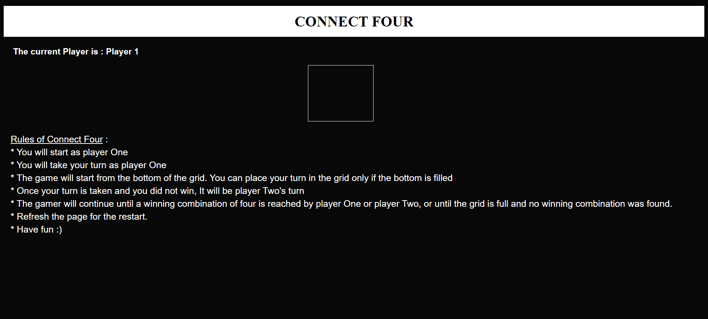

# connect-four
A retro grid-based game in vanilla JavaScript, HTML and CSS

Connect Four (also known as Four Up, Plot Four, Find Four, Four in a Row, Four in a Line, Drop Four, and Gravitrips (in Soviet Union)) is a two-player board game in which the players first choose a color and then take turns dropping one colored disc from the top into a seven-column, six-row vertically suspended grid. The pieces fall straight down, occupying the lowest available space within the column. The objective of the game is to be the first to form a horizontal, vertical, or diagonal line of four of one's own discs.

To use this project follow the steps :
1. Clone the repo
2. Open index.html file in a browser.
3. I have kept the styling at a bare miniumum for you to go wild and make it your own.

## Rules of Connect Four
* You will start as player One
* You will take your turn as player One
* The game will start from the bottom of the grid. You can place your turn in the grid only if the bottom is filled
* Once your turn is taken and you did not win, It will be player Two's turn
* The gamer will continue until a winning combination of four is reached by player One or player Two, or until the grid is full and no winning combination was found.
* Refresh the page for the restart
* Have fun :)

# Overview of how the game looks

1. Front view of the game before starting.

3. Showing the player details while playing the game.

*Play and have fun :)*
